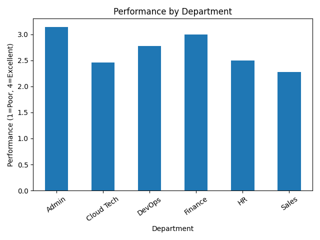
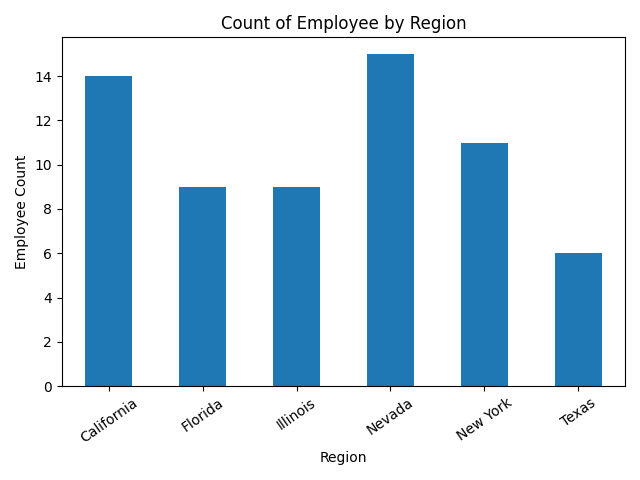

# EDA
## 1. Descriptive Statistics

|                   |   Uniqueness_Count |   Uniqueness_Ratio |     Mean |   Median |   Standard_Deviation |
|:------------------|-------------------:|-------------------:|---------:|---------:|---------------------:|
| Employee_ID       |                 64 |           1        |   nan    |      nan |               nan    |
| First_Name        |                  8 |           0.125    |   nan    |      nan |               nan    |
| Last_Name         |                  8 |           0.125    |   nan    |      nan |               nan    |
| Age               |                  4 |           0.0625   |    32.13 |       30 |                 6.06 |
| Status            |                  3 |           0.046875 |   nan    |      nan |               nan    |
| Join_Date         |                 61 |           0.953125 |   nan    |      nan |               nan    |
| Salary            |                 63 |           0.984375 | 83564.6  |    84946 |             18866.7  |
| Email             |                 64 |           1        |   nan    |      nan |               nan    |
| Phone             |                 61 |           0.953125 |   nan    |      nan |               nan    |
| Performance_Score |                  4 |           0.0625   |   nan    |      nan |               nan    |
| Remote_Work       |                  2 |           0.03125  |   nan    |      nan |               nan    |
| Department        |                  6 |           0.09375  |   nan    |      nan |               nan    |
| Region            |                  6 |           0.09375  |   nan    |      nan |               nan    |

Descriptive statistics were calculated for all columns. Numeric variables were summarized using mean, median, standard deviation, and uniqueness, while categorical variables were assessed using uniqueness only. Employee_ID and Email were fully unique and treated as identifiers, not features. Salary showed high variability across employees, while Join_Date was highly unique and later converted into tenure for further clustering analysis. Several variables, including Department, Region, Remote_Work, and Performance_Score, had low uniqueness, confirming their categorical or ordinal nature.

## 2. Calculated Statistics

Figure 1: Admin and Finance account for the largest share of total salary, while HR has the lowest total salary. These differences are a result of both compensation levels and department size.

Figure 2: Performance scores were converted to ordinal values for visualization ranging from 1: poor, to 4: excellent. After finding the mean to find the average performance per department, I found that Admin and Finance have the highest average performance scores, while Sales has the lowest.

Figure 3: Employee counts are uneven across regions. Nevada and California have the highest number of employees, while Texas has the fewest suggesting that the workforce is concentrated in a small number of regions.

## 3. Clustering

|   cluster |   Performance_Ordinal |   Remote_Work |   Salary |   Tenure_Years |
|----------:|----------------------:|--------------:|---------:|---------------:|
|         0 |               3.07692 |      0        |  77030.5 |        2.02803 |
|         1 |               1.9375  |      0        |  92548.2 |        4.31336 |
|         2 |               2.72727 |      1        |  69580.4 |        3.40498 |
|         3 |               3.41667 |      0.833333 | 104303   |        5.00457 |

Clustering shows that employees group more strongly by tenure and salary than by performance on it's own. Higher performance tends to appear more often among longer-tenured and higher-paid employees, but this relationship is not consistent across all groups. Remote work also forms a distinct grouping, suggesting work arrangement influences how employees cluster alongside performance.
